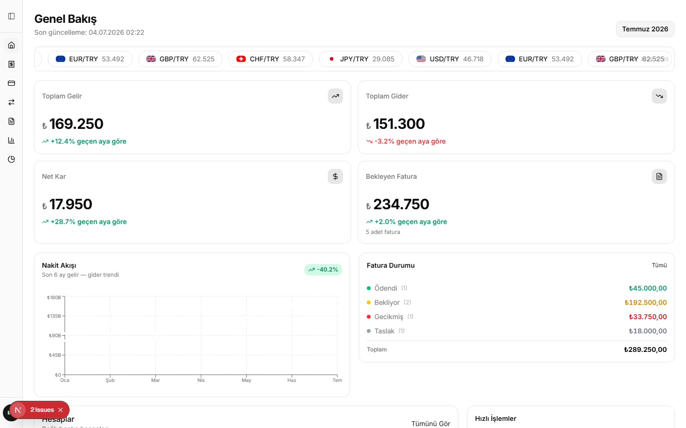
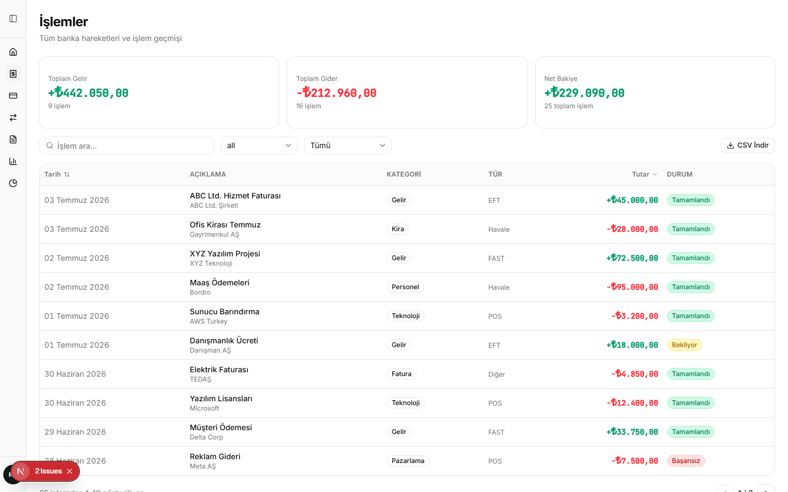
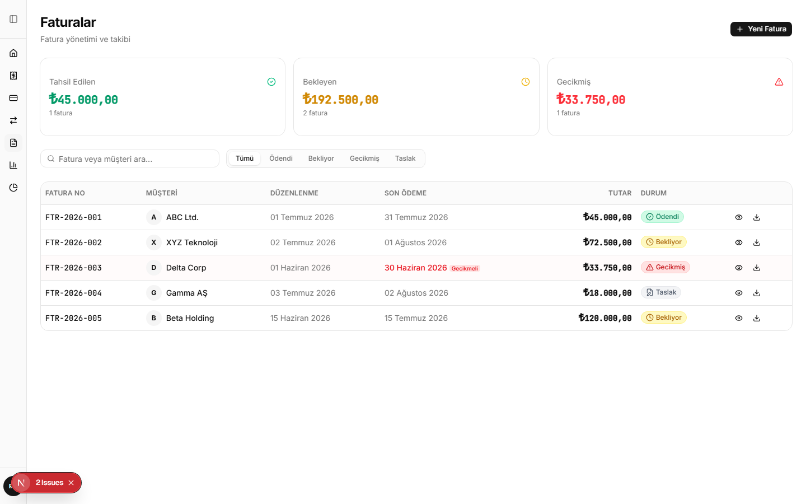
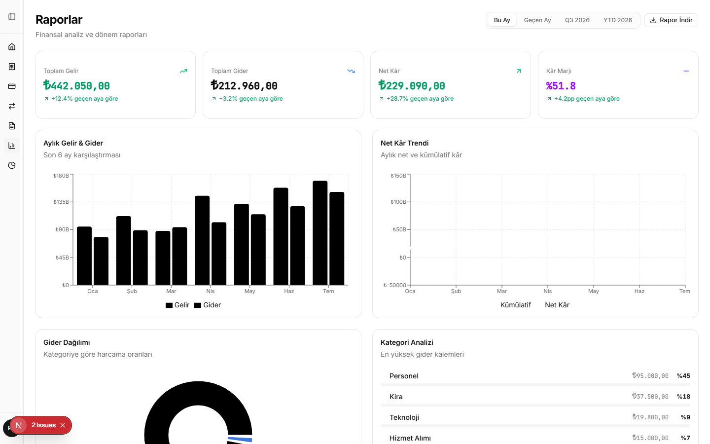
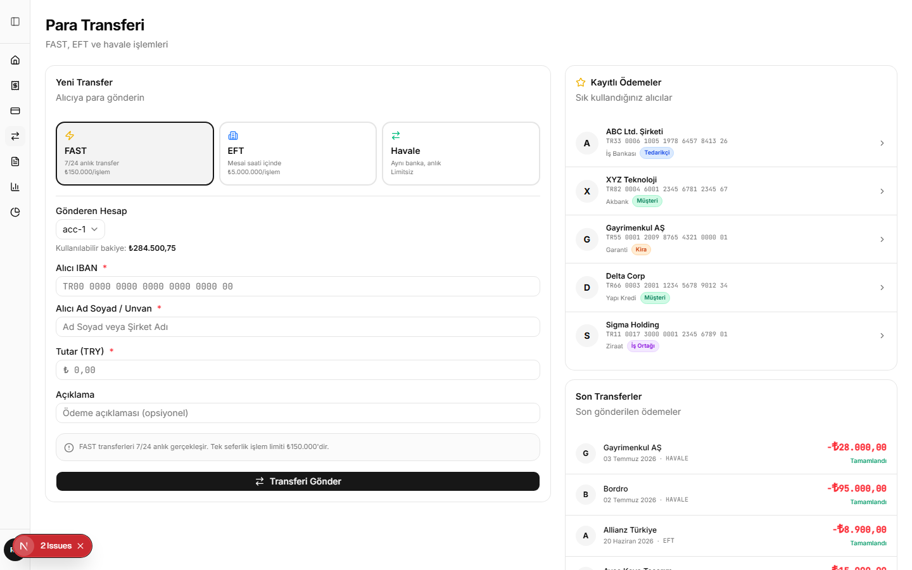

# Rusk Muhasebe

Türk işletmeleri için geliştirilmiş modern, full-stack muhasebe uygulaması. Gelir/gider takibi, fatura yönetimi, banka entegrasyonu, para transferi ve finansal raporlama tek bir arayüzde.



---

## Özellikler

### Dashboard
- Anlık KPI kartları (gelir, gider, net kâr, bekleyen fatura tutarı)
- Canlı döviz kuru bandı (TCMB API)
- Nakit akışı trend grafiği (son 6 ay)
- Fatura durumu özeti, hızlı işlem kısayolları ve bütçe takibi
- Widget açma/kapama — her kullanıcı kendi dashboard'ını özelleştirir, localStorage'da kalıcı

### İşlemler

- 25+ gerçekçi işlem verisi
- Tür (gelir/gider) ve kategori filtresi + arama
- Toplam gelir/gider/net stat kartları
- Satıra tıklayınca detay drawer (makbuz indir, işlemi tekrarla)
- CSV export

### Faturalar

- Durum bazlı filtre tabs (Tümü / Ödendi / Bekliyor / Gecikmiş / Taslak)
- Fatura detay sheet — KDV hesaplaması, kalem listesi, PDF indir, e-posta gönder
- Gecikmiş faturalarda hatırlatma gönderme
- Yeni fatura oluşturma dialog formu

### Raporlar

- Dönem seçici (Bu Ay / Geçen Ay / Q3 / YTD)
- 4 KPI kartı: Toplam Gelir, Gider, Net Kâr, Kâr Marjı
- Aylık Gelir & Gider bar chart
- Net Kâr trend line chart (aylık + kümülatif)
- Kategori bazlı gider dağılımı (pie chart + progress bar analizi)
- Rapor indirme

### Para Transferi

- FAST / EFT / Havale türü seçimi (limit ve kural bilgileriyle)
- Gönderen hesap seçimi + bakiye kontrolü
- Kayıtlı ödemeler (kategori badge'leri: Tedarikçi, Müşteri, Kira, İş Ortağı)
- Son transferler listesi

### Banka Entegrasyonları
- Türkiye İş Bankası, Akbank, Garanti BBVA, Yapı Kredi
- Her banka için OAuth 2.0 bağlantı akışı simülasyonu
- API yönetimi — her endpoint switch ile açılıp kapanır
- Gerçek banka logoları (Google Favicon servisi)

### Ayarlar
- Profil, Hesap, Görünüm, Bildirimler, Banka Entegrasyonları, Ekran sekmeleri
- Dialog olarak açılır (ayrı sayfa değil)
- Görünüm → Dashboard widget'larını gerçek zamanlı açıp kapat

---

## Teknoloji Yığını

| Katman | Teknoloji |
|--------|-----------|
| Framework | Next.js 15 (App Router) |
| UI | shadcn/ui + Tailwind CSS v4 |
| Grafikler | Recharts |
| Tablo | TanStack Table v8 |
| Font | Inter + JetBrains Mono |
| State | React Context + localStorage |
| API | TCMB döviz kuru (gerçek zamanlı) |
| Animasyon | BlurFade (özel) |

---

## Kurulum

```bash
# Bağımlılıkları yükle
npm install

# Geliştirme sunucusunu başlat
npm run dev

# Üretim build
npm run build
npm start
```

Uygulama varsayılan olarak `http://localhost:3000` adresinde açılır.

---

## Proje Yapısı

```
src/
├── app/
│   ├── (dashboard)/
│   │   ├── dashboard/      # Ana dashboard
│   │   ├── transactions/   # İşlemler
│   │   ├── invoices/       # Faturalar
│   │   ├── transfers/      # Para transferi
│   │   ├── reports/        # Raporlar
│   │   └── budget/         # Bütçe yönetimi
│   └── layout.tsx          # Root layout + SEO metadata
├── components/
│   ├── dashboard/          # Dashboard widget'ları
│   ├── layout/             # Sidebar, header, ayarlar dialog
│   └── ui/                 # shadcn/ui bileşenleri
├── contexts/
│   └── dashboard-prefs.tsx # Widget açma/kapama state
└── lib/
    ├── mock-data.ts         # Örnek veriler
    ├── formatters.ts        # Para/tarih formatlayıcılar
    └── constants.ts         # Sabitler ve durum eşlemeleri
```

---

## Ekran Görüntüleri

| Sayfa | Görüntü |
|-------|---------|
| Dashboard |  |
| İşlemler |  |
| Faturalar |  |
| Raporlar |  |
| Transferler |  |

---

## Lisans

MIT